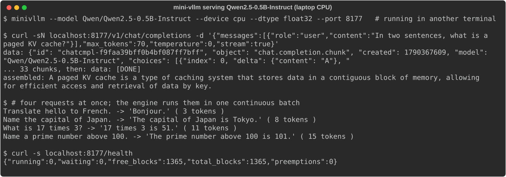

# mini-vllm

> **Credits.** Built by Amaan Mithani with Claude (Anthropic) as the AI coding assistant.

A small LLM inference engine with the two ideas that make vLLM fast, **a paged KV cache** and **continuous
batching**, serving Qwen2.5 behind an OpenAI-compatible API. About 700 lines of PyTorch: the model is written from
scratch and checked token-for-token against Hugging Face's implementation.

## See it running



*Real session, unedited: `minivllm` serving Qwen2.5-0.5B-Instruct on a MacBook CPU (float32, one thread; see Limits), queried with curl. The answers are the 0.5B model's own.*

## Use

```sh
uv sync --extra server
uv run minivllm --model Qwen/Qwen2.5-0.5B-Instruct --kv-cache-gib 4        # CUDA, fp16
uv run minivllm --device cpu --dtype float32 --kv-cache-gib 0.5            # works on a laptop too
curl -sN localhost:8000/v1/chat/completions -H 'content-type: application/json' \
  -d '{"messages":[{"role":"user","content":"Hello"}],"max_tokens":64,"stream":true}'
```

Endpoints: `/v1/chat/completions` and `/v1/completions` (streaming or not, `temperature`, `top_p`, `seed`, `stop`,
`max_tokens`), `/v1/models`, and `/health` (running and waiting requests, free KV blocks, preemptions). Any
OpenAI-compatible client works, including the ModelMux gateway (an `openai`-type provider with this base URL).

As a library:

```python
from minivllm import Engine, SamplingParams
from minivllm.loader import load

m = load("Qwen/Qwen2.5-0.5B-Instruct")
engine = Engine(m.model, num_blocks=4096)
outs = engine.generate([m.tokenizer.chat([{"role": "user", "content": "Hi"}])], SamplingParams(max_tokens=32))
```

## How it works

- **Model** (`model.py`): Qwen2 (RMSNorm, rotary embeddings, grouped-query attention with qkv bias, SwiGLU, tied
  embeddings), loaded from the HF safetensors checkpoint. A forward pass takes a flat batch of tokens:
  - a **prefill** is several prompts concatenated, each attending causally to itself;
  - a **decode** is one token per sequence, attending to that sequence's cached keys and values.
- **Paged KV cache** (`cache.py`): one preallocated pool per layer of fixed-size blocks (16 tokens). A free-list
  allocator hands blocks out and takes them back in O(1). Each sequence has a block table, and token *p* is stored in
  block `table[p // 16]`, row `p % 16`. Memory is allocated as sequences grow, so nothing is reserved for the maximum
  length.
- **Scheduler** (`engine.py`), continuous batching. Every step is either:
  - a prefill: admit waiting sequences under a token budget, keeping one free block per running sequence as headroom;
  - or a decode: one token for every running sequence.

  Requests join and leave between steps. When a decode needs a block and the pool is empty, the most recently
  admitted sequence is **preempted**: its blocks are freed and it is recomputed later from its prompt plus the tokens
  it already produced. Tests check that the recomputed output is identical.
- **Server** (`server.py`): a single engine thread owns the model. HTTP handlers hand requests in through a
  thread-safe inbox and receive tokens on per-request asyncio queues, so concurrent HTTP requests end up in the same
  batch. A client that disconnects frees its blocks.

## Correctness

<!-- correctness:start -->
- **Chat template and tokenizer:** identical to HF `apply_chat_template` + tokenizer on all 128 benchmark
  prompts (text and token ids; transformers 5.17.0, `bench/check_template.py`). The Kaggle run's own
  template check reported 0 %. The check itself was wrong, not the tokenizer: it compared against the raw return value
  of HF's tokenizer call. The check in `bench/bench.py` now uses `encode`, and the standalone comparison above is the
  evidence.
- **Greedy output vs HF `generate` on the T4 (fp16):** 57/64 prompts
  identical for 64 tokens. The other 7 diverge after 13–59 matching tokens.
  In fp16 two nearly equal logits can come out in either order depending on the kernel, and after that the greedy paths
  split. On CPU in fp32 (CI), logits and greedy outputs are identical to HF's.
- **Tests on the T4:** 20 passed, 2 warnings in 22.21s (`results/t4-tests.txt`).
<!-- correctness:end -->

## Performance on a T4

<!-- perf:start -->
Tesla T4, torch 2.10.0+cu128, transformers 5.0.0, CUDA 12.8. Model `Qwen/Qwen2.5-0.5B-Instruct` in fp16.
128 requests (prompts from `bench/prompts.json`, mean 39 tokens after the chat template),
EOS ignored so both systems generate the same tokens. KV cache: 6.0 GiB = 32,768 blocks of 16.
Closed loop: C requests in flight; HF runs consecutive groups of C as left-padded static batches.

**Mixed output lengths** (16–240 tokens per request, mean 132; the same lengths for both).
A static batch runs until its longest request finishes; continuous batching starts the next request as soon as one ends.

| concurrency | mini-vllm tok/s | HF generate tok/s | mini-vllm / HF | mini-vllm p50 / p99 s | HF p50 / p99 s |
|---|---|---|---|---|---|
| 1 | 33 | 31 | 1.07× | 4.2 / 7.3 | 4.5 / 7.8 |
| 2 | 67 | 52 | 1.29× | 4.1 / 7.1 | 5.0 / 7.5 |
| 4 | 130 | 89 | 1.46× | 4.2 / 7.3 | 6.6 / 7.2 |
| 8 | 243 | 157 | 1.55× | 4.4 / 7.7 | 6.9 / 7.2 |
| 16 | 445 | 300 | 1.48× | 4.5 / 7.9 | 7.1 / 7.4 |
| 32 | 701 | 564 | 1.24× | 5.2 / 9.6 | 7.6 / 7.6 |
| 64 | 975 | 1,025 | 0.95× | 6.5 / 12.1 | 8.3 / 8.3 |

**Fixed output length** (128 tokens for every request, the best case for static batching).

| concurrency | mini-vllm tok/s | HF generate tok/s | mini-vllm / HF | mini-vllm p50 / p99 s | HF p50 / p99 s |
|---|---|---|---|---|---|
| 1 | 33 | 31 | 1.07× | 3.9 / 4.0 | 4.2 / 4.2 |
| 2 | 68 | 66 | 1.03× | 3.8 / 3.8 | 3.8 / 4.3 |
| 4 | 132 | 132 | 1.00× | 3.9 / 4.0 | 3.9 / 4.1 |
| 8 | 261 | 262 | 1.00× | 3.9 / 4.0 | 3.9 / 4.0 |
| 16 | 506 | 517 | 0.98× | 4.0 / 4.1 | 3.9 / 4.0 |
| 32 | 963 | 1,010 | 0.95× | 4.3 / 4.3 | 4.1 / 4.1 |
| 64 | 1,631 | 1,909 | 0.85× | 5.0 / 5.0 | 4.3 / 4.3 |

Throughput counts only the tokens each request asked for. Latency runs from when a request is started until its last
token, for both systems.
<!-- perf:end -->

**Reading the numbers.**
- With mixed lengths, continuous batching is ahead at moderate concurrency, because static batches sit waiting for
  their longest request.
- At 64 concurrent requests, HF's batched `generate` catches up or wins. mini-vllm's decode step copies each
  sequence's cached keys and values into a padded tensor, layer by layer, before attention, and runs the scheduler in
  Python. vLLM avoids both with a paged-attention kernel and CUDA graphs.
- With fixed lengths, static batching never waits on a long request, so it is the fair best case for HF; there the
  two are roughly level up to 32.

Reproduce: `python kaggle/build.py && uvx kaggle kernels push -p kaggle/kernel`, then
`uvx kaggle kernels output amaanmithani/mini-vllm-bench -p results/` and `uv run python bench/report.py`.

## Limits

- Qwen2-family models only. No tensor parallelism, prefix caching, chunked prefill, CUDA graphs, quantisation or
  speculative decoding.
- Decode attention gathers each sequence's blocks into a padded tensor with PyTorch indexing, so it isn't a fused
  paged-attention kernel. This costs throughput at high concurrency (see above).
- Preemption is by recomputation, not by swapping to host memory.
- Measured on one T4 with one model and one prompt set. Each configuration was run once.
- On CPU the server runs PyTorch with one thread unless `OMP_NUM_THREADS` is set. With the default thread pool, a
  matmul in the engine thread deadlocked intermittently on a heavily loaded Mac, with every OpenMP worker parked at a
  barrier (observed with macOS `sample`). One thread is slow but hasn't hung. CUDA is unaffected.

## Development

```sh
uv sync && uv run pytest --cov      # tiny random Qwen2 vs HF transformers on CPU; coverage >= 85 %
uv run ruff check . && uv run mypy
```
